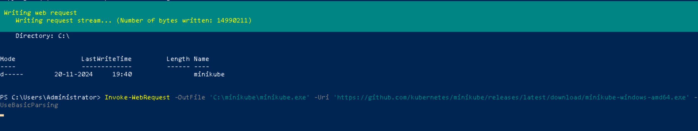

# **Set up a local Kubernetes cluster Lab Guide using Minikube**

## Table of Contents

* [**Introduction**](#introduction)  
* [**Problem Statement**](#problem-statement)  
* [**Prerequisites**](#prerequisites)  
  - [**Software Requirements**](#software-requirements)  
  - [**Hardware Requirements**](#hardware-requirements)  
* [**Setup Instructions**](#setup-instructions)
  * [**Set Up a Local Kubernetes Cluster Using Minikube**](#set-up-a-local-kubernetes-cluster-using-minikube)  
* [**References**](#references)  

---

## Introduction

This guide outlines the steps required to set up a local Kubernetes cluster on a Windows system using either Minikube or Kind. By following the instructions, you will be able to create a Kubernetes cluster locally to practice deploying, managing, and testing applications.

---

## Problem Statement

Setting up Kubernetes on Windows can be a challenging process due to differences in operating system architecture and compatibility issues with certain tools. This guide simplifies the setup process by offering clear, step-by-step instructions for creating a local Kubernetes cluster using Minikube or Kind, two widely-used solutions for running Kubernetes on a local machine.

---

## Prerequisites

### Software Requirements

- **Windows 10 or later**
- **Docker Desktop for Windows** (for Kind)
- **kubectl** (Kubernetes command-line tool)
- **Windows Subsystem for Linux 2 (WSL2)**

### Hardware Requirements

- **CPU**: Minimum 2 CPUs  
- **Memory**: Minimum 4GB RAM (recommended 8GB or more)  
- **Disk Space**: At least 10GB of free space

---

## Setup Instructions

### Set Up a Local Kubernetes Cluster Using Minikube.

**Step 1: Install Minikube**  

- **Download and Install the Latest Minikube Release**:  

  To install the latest stable release of Minikube on x86-64 Windows, follow these steps:
     
- **Manual Installation**:

  - Visit the [Minikube releases page](https://github.com/kubernetes/minikube/releases) and download the latest installer for Windows.
     
  - **PowerShell Installation**:  
    
    If you prefer to use PowerShell, run the following commands:
       
    ```powershell
    New-Item -Path 'C:\' -Name 'minikube' -ItemType Directory -Force
    Invoke-WebRequest -OutFile 'C:\minikube\minikube.exe' -Uri 'https://github.com/kubernetes/minikube/releases/latest/download/minikube-windows-amd64.exe' -UseBasicParsing
    ```

    

  Make sure to run PowerShell as Administrator to execute these commands.

- **Add Minikube to Your PATH**: 

  After downloading, you need to add the Minikube binary to your system's PATH. Run the following command in PowerShell:
     
  ```powershell
  $oldPath = [Environment]::GetEnvironmentVariable('Path', [EnvironmentVariableTarget]::Machine)
  if ($oldPath.Split(';') -inotcontains 'C:\minikube') {
    [Environment]::SetEnvironmentVariable('Path', $('{0};C:\minikube' -f $oldPath), [EnvironmentVariableTarget]::Machine)
  }
  ```

  

- **Restart Your Terminal**:

  If you used PowerShell for installation, close the terminal and reopen it before running Minikube commands

**Step 2: Install `kubectl`**

- **Download kubectl with curl**  

  - If you have `curl` installed, you can download `kubectl` directly using the following command:
     
    ```bash
    curl.exe -LO "https://dl.k8s.io/release/v1.31.0/bin/windows/amd64/kubectl.exe"
    ```

- **(Optional) Validate the Binary**  
   
  - To ensure the downloaded binary is not corrupted, you can validate it against the checksum file.
  - Download the checksum file:
     
    ```bash
    curl.exe -LO "https://dl.k8s.io/v1.31.0/bin/windows/amd64/kubectl.exe.sha256"
    ```

- **Validate the kubectl Binary**  
   
  - Using Command Prompt, manually compare the SHA256 hash:
     
    ```bash
    CertUtil -hashfile kubectl.exe SHA256
    type kubectl.exe.sha256
    ```
   
  - Alternatively, use PowerShell to automate the verification:
     
    ```powershell
    $(Get-FileHash -Algorithm SHA256 .\kubectl.exe).Hash -eq $(Get-Content .\kubectl.exe.sha256)
    ```

- **Test kubectl Installation** 

  - Again, open a terminal and verify the installation:
     
    ```bash
    kubectl version --client
    ```

  - For detailed version information, use:
     
    ```bash
    kubectl version --client --output=yaml
    ```

**Step 3: Start your cluster**:

  From a PowerShell with administrator access run( Make sure your `Docker Desktop` is running ):

  ```powershell
  minikube start
  ```

  

**Step 4: Interact with your cluster**

Once you have `kubectl` installed, you can use it to interact with your Kubernetes cluster. To verify that your setup is working and to see the resources in your cluster, use the following command:

```bash
kubectl get po -A
```

- **Explanation:**

  - `kubectl`: The command-line tool for interacting with Kubernetes.
  - `get`: This command retrieves information about resources in the cluster.
  - `po`: This stands for "pods." Pods are the smallest deployable units in Kubernetes, representing a single instance of a running process in your cluster.
  - `-A`: This flag stands for "all namespaces." It allows you to view pods from all namespaces in your cluster.

  

---

## References

- [Minikube Documentation](https://minikube.sigs.k8s.io/docs/start/?arch=%2Fwindows%2Fx86-64%2Fstable%2F.exe+download)
- [Docker Desktop for Windows](https://www.docker.com/products/docker-desktop)

---