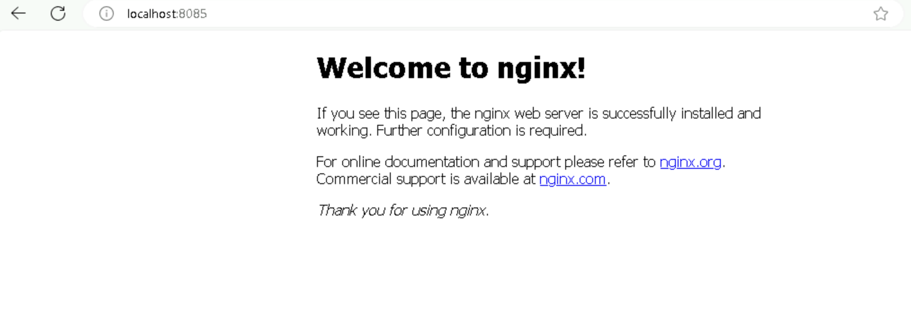

# **Deploy a Web Application Using a Kubernetes Deployment and Service**

## Table of Contents

1. [**Introduction**](#introduction)  
2. [**Problem Statement**](#problem-statement)  
3. [**Prerequisites**](#prerequisites)   
4. [**Setup Instructions**](#setup-instructions)  
   - [**Step 1: Create a Deployment for NGINX**](#step-1-create-a-deployment-for-nginx)  
   - [**Step 2: Create a Service to Expose NGINX**](#step-2-create-a-service-to-expose-nginx)  
   - [**Step 3: Accessing the NGINX Application**](#step-3-accessing-the-nginx-application)
5. [**References**](#references)  

---

## Introduction

This guide is designed to help users set up and deploy web applications in a local Kubernetes environment using Minikube on a Windows system. Minikube is an open-source tool that runs a single-node Kubernetes cluster on your local machine, providing an easy-to-use environment for Kubernetes learning, development, and testing.

**By following this guide, you will learn:**

* How to set up a Kubernetes cluster locally using Minikube.
* How to deploy web applications using Kubernetes Deployment and manage their lifecycle.
* How to expose your web applications to internal or external traffic using Kubernetes Service.

---

## Problem Statement

In this lab, we will deploy an NGINX-based web application on a local Kubernetes cluster using **Minikube**. We will create a Kubernetes Deployment to manage the application’s lifecycle and a Service to expose it.

---

## Prerequisites
Completion of all previous lab guides (up to Lab Guide-01) is required before proceeding with Lab Guide-02.

- Minikube is running on your Windows system.
- `kubectl` is installed and configured to interact with your Minikube cluster.

---

## Setup Instructions

### Step 1: Create a Deployment for NGINX

We will start by deploying NGINX using a Kubernetes Deployment. The Deployment ensures that NGINX is running in a stable state with three replicas.

1. **Create the YAML for Deployment**  

   Create a new file called `nginx-deployment.yaml` in your working directory with the following content:
   
   ```yaml
   apiVersion: apps/v1
   kind: Deployment
   metadata:
     name: nginx-deployment
   spec:
     replicas: 3
     selector:
       matchLabels:
         app: nginx
     template:
       metadata:
         labels:
           app: nginx
       spec:
         containers:
         - name: nginx
           image: nginx:latest
           ports:
           - containerPort: 80
   ```

   **Key points:**

   - **replicas**: 3 instances of NGINX will be deployed.
   - **image**: NGINX is pulled from the official Docker image (`nginx:latest`).
   - **ports**: Exposes port 80 inside the container.

2. **Deploy NGINX to Kubernetes** 

   Apply the `nginx-deployment.yaml` file by running the following command:

   ```bash
   kubectl apply -f nginx-deployment.yaml
   ```
   


3. **Verify the Deployment**

   Check the status of the deployment and ensure the pods are running:

   ```bash
   kubectl get deployments
   kubectl get pods
   ```

   

   You should see three pods running for the `nginx-deployment`.

### Step 2: Create a Service to Expose NGINX

Next, we will create a Service to expose the NGINX application inside the cluster. A **ClusterIP** service will be used to make the application accessible to other pods within the cluster.

1. **Create the YAML for Service**  

   Create a new file called `nginx-service.yaml` with the following content:
   
   ```yaml
   apiVersion: v1
   kind: Service
   metadata:
     name: nginx-service
   spec:
     type: ClusterIP
     selector:
       app: nginx
     ports:
     - port: 80
       targetPort: 80
   ```

   **Key points:**

   - **type: ClusterIP**: Exposes the service within the cluster (internal access).
   - **selector**: Targets the pods labeled with `app: nginx`.
   - **ports**: Exposes port 80 both internally and in the container.

2. **Deploy the Service**  

   Apply the `nginx-service.yaml` by running the following command:

   ```bash
   kubectl apply -f nginx-service.yaml
   ```

3. **Verify the Service** 

   Check the service status and ensure it's running:

   ```bash
   kubectl get services
   ```

   

   You should see the `nginx-service` listed.

### Step 3: Accessing the NGINX Application

Since this service is internal to the cluster, you can use `kubectl` to forward the local port to access NGINX from your browser.

1. **Port-forward the Service** 

   Run the following command to forward a local port (e.g., 8085) to the NGINX pod:

   ```bash
   kubectl port-forward service/nginx-service 8085:80
   ```
   
   


2. **Open NGINX in Your Browser** 

   Open your browser and navigate to `http://localhost:8085`. You should see the default NGINX welcome page.

   

---

## References

- [Kubernetes Deployment Documentation](https://kubernetes.io/docs/concepts/workloads/controllers/deployment/)
- [Kubernetes Service Documentation](https://kubernetes.io/docs/concepts/services-networking/service/)

---
