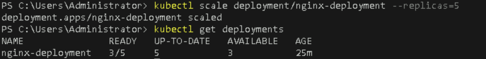

# **Scale the Deployment Up and Down Using `kubectl scale`**

## Table of Contents

1. [**Introduction**](#introduction)  
2. [**Problem Statement**](#problem-statement)  
3. [**Prerequisites**](#prerequisites)   
4. [**Setup Instructions**](#setup-instructions)  
   - [**Step 1: Check the Current Deployment Status**](#step-1-check-the-current-deployment-status)
   - [**Step 2: Scale the Deployment Up**](#step-2-scale-the-deployment-up)
   - [**Step 3: Scale the Deployment Down**](#step-3-scale-the-deployment-down)
   - [**Step 4: Clean Up**](#step-4-clean-up)
5. [**References**](#references)  

---

## Introduction

This section of the Kubernetes guide focuses on the essential task of scaling applications within a Kubernetes environment. Scaling is a critical feature of Kubernetes that allows you to adjust the number of running instances of an application based on demand. This capability helps ensure that your applications remain responsive and available under varying loads.

In this guide, we will specifically cover how to scale an NGINX deployment using the `kubectl scale` command in a Minikube environment. You will learn how to:

- **Increase or decrease the number of replicas** for your application to handle changes in traffic efficiently.
- **Monitor the status** of your deployment before and after scaling to understand the impact of your changes.
- **Understand the implications of scaling**, including how it can enhance performance and resource utilization.

---

## Problem Statement

In this lab, we will explore how to scale a running application in Kubernetes. Scaling allows you to adjust the number of replicas of your application in response to traffic demands or system load. This can be done easily using the `kubectl scale` command.

---

## Prerequisites
Completion of all previous lab guides (up to Lab Guide-02) is required before proceeding with Lab Guide-03.

- You have a working NGINX deployment already set up in your Minikube cluster (refer to the previous lab on deploying a web application).
- You have `kubectl` installed and configured to interact with your Minikube cluster.

---

## Setup Instructions

### Step 1: Check the Current Deployment Status

Before scaling the deployment, it’s important to verify the current state of your NGINX deployment.

1. **Get Current Deployment Status**  

   Run the following command to check the status of your deployment:

   ```bash
   kubectl get deployments
   ```

   

   This will show you the number of replicas currently running for your NGINX deployment.

### Step 2: Scale the Deployment Up

To handle increased traffic, you can scale the deployment by increasing the number of replicas.

1. **Scale Up the Deployment**  

   Use the following command to scale your NGINX deployment to 5 replicas:

   ```bash
   kubectl scale deployment/nginx-deployment --replicas=5
   ```

2. **Verify the Scaling**  

   After scaling, verify that the number of replicas has increased:

   ```bash
   kubectl get deployments
   ```

   

   You should see that the `UP-TO-DATE` and `AVAILABLE` columns reflect 5 replicas.

### Step 3: Scale the Deployment Down

Conversely, if you need to reduce resource usage during low traffic periods, you can scale the deployment down.

1. **Scale Down the Deployment**  

   Use the following command to scale your NGINX deployment back down to 2 replicas:

   ```bash
   kubectl scale deployment/nginx-deployment --replicas=2
   ```

2. **Verify the Scaling**  

   Again, check the deployment status to confirm the scaling operation:

   ```bash
   kubectl get deployments
   ```
   

   The `UP-TO-DATE` and `AVAILABLE` columns should now reflect 2 replicas.

### Step 4: Clean Up

If you no longer need the NGINX deployment, you can delete it using the following command:

```bash
kubectl delete deployment nginx-deployment
```


---

## References

- [Kubernetes Scaling Documentation](https://kubernetes.io/docs/concepts/workloads/controllers/deployment/#scaling-deployments)

---