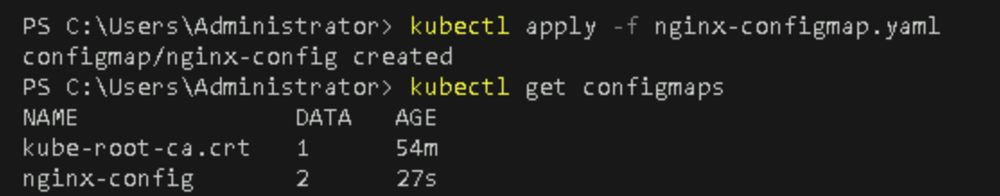
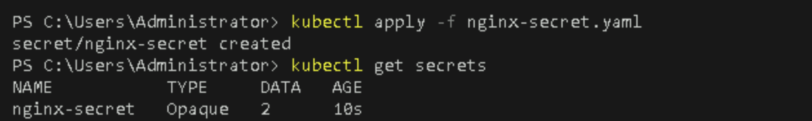

# **Create and Use ConfigMaps and Secrets in a Kubernetes Pod**

## Table of Contents

1. [**Introduction**](#introduction)  
2. [**Problem Statement**](#problem-statement)  
3. [**Prerequisites**](#prerequisites)  
4. [**Setup Instructions**](#setup-instructions)  
   - [**Step 1: Create a ConfigMap**](#step-1-create-a-configmap)  
   - [**Step 2: Create a Secret**](#step-2-create-a-secret)  
   - [**Step 3: Use ConfigMaps and Secrets in a Pod**](#step-3-use-configmaps-and-secrets-in-a-pod)  
5. [**References**](#references)  

---

## Introduction

Kubernetes provides two essential resources for managing configuration data and sensitive information: **ConfigMaps** and **Secrets**. These resources allow you to externalize application configuration and securely store sensitive data such as passwords, API keys, and other credentials.

- **ConfigMaps**: Used to store non-sensitive configuration data in key-value pairs, such as environment variables or configuration files.
- **Secrets**: Used to store sensitive information, with additional features like base64 encoding to enhance security.

In this lab, you will learn how to:
- Create a ConfigMap to store configuration data.
- Create a Secret to store sensitive information.
- Use both ConfigMaps and Secrets within a Kubernetes pod to configure and secure your application.

---

## Problem Statement

As your applications grow, it becomes important to separate the application code from its configuration data. You may also need to store sensitive information securely, without hardcoding it in your application.

This lab aims to show you how to manage this external configuration through **ConfigMaps** and **Secrets**, and how to use them inside a pod to ensure that your applications can access configuration data and secrets securely.

---

## Prerequisites
Completion of all previous lab guides (up to Lab Guide-03) is required before proceeding with Lab Guide-04.

- A running Kubernetes cluster on Minikube.
- `kubectl` installed and configured to interact with your Minikube cluster.
- Basic understanding of Kubernetes pods and deployments.

---

## Setup Instructions

### Step 1: Create a ConfigMap

A ConfigMap is a way to store key-value pairs for configuration. In this example, we will create a ConfigMap that stores some environment variables for an NGINX pod.

1. **Create a ConfigMap YAML File**  

   Create a file named `nginx-configmap.yaml` with the following content:
   
   ```yaml
   apiVersion: v1
   kind: ConfigMap
   metadata:
     name: nginx-config
   data:
     welcome-message: "Welcome to NGINX running in Kubernetes!"
     log-level: "info"
   ```

   - **welcome-message**: Stores a custom message for the NGINX web server.
   - **log-level**: Specifies the log level for NGINX.

2. **Apply the ConfigMap** 

   Run the following command to create the ConfigMap in your cluster:

   ```bash
   kubectl apply -f nginx-configmap.yaml
   ```

3. **Verify the ConfigMap**  

   Check that the ConfigMap was created successfully:

   ```bash
   kubectl get configmaps
   ```
   

### Step 2: Create a Secret

A Secret is used to store sensitive information like passwords or API keys. We will create a Secret to store a basic authentication password for NGINX.

1. **Create a Secret YAML File** 

   Create a file named `nginx-secret.yaml` with the following content. The secret data needs to be base64 encoded.
   
   ```yaml
   apiVersion: v1
   kind: Secret
   metadata:
     name: nginx-secret
   data:
     username: YWRtaW4=   # base64 for "admin"
     password: cGFzc3dvcmQ=   # base64 for "password"
   ```

   - **username**: Base64 encoded username (`admin`).
   - **password**: Base64 encoded password (`password`).

2. **Apply the Secret**  

   Run the following command to create the Secret:

   ```bash
   kubectl apply -f nginx-secret.yaml
   ```

3. **Verify the Secret** 

   List all the secrets to ensure it was created:

   ```bash
   kubectl get secrets
   ```

   
   
   You can also decode the secret values if needed:

   ```bash
   kubectl get secret nginx-secret -o yaml
   ```

   

### Step 3: Use ConfigMaps and Secrets in a Pod

Next, we'll create an NGINX pod that uses the ConfigMap and Secret we just created. The ConfigMap will be used for environment variables, and the Secret will be mounted as a file.

1. **Create the Pod YAML File**

   Create a file named `nginx-pod-config-secret.yaml` with the following content:

   ```yaml
   apiVersion: v1
   kind: Pod
   metadata:
     name: nginx-pod
   spec:
     containers:
     - name: nginx
       image: nginx:latest
       ports:
       - containerPort: 80
       env:
       - name: WELCOME_MESSAGE
         valueFrom:
           configMapKeyRef:
             name: nginx-config
             key: welcome-message
       - name: LOG_LEVEL
         valueFrom:
           configMapKeyRef:
             name: nginx-config
             key: log-level
       volumeMounts:
       - name: secret-volume
         mountPath: "/etc/nginx/secret"
         readOnly: true
     volumes:
     - name: secret-volume
       secret:
         secretName: nginx-secret
   ```

   Key points:

   - **env**: Environment variables are set using values from the ConfigMap (`nginx-config`).
   - **volumeMounts**: The Secret is mounted into the container as a volume at `/etc/nginx/secret`.

2. **Apply the Pod Configuration** 

   Run the following command to create the pod:

   ```bash
   kubectl apply -f nginx-pod-config-secret.yaml
   ```

3. **Verify the Pod**

   Ensure that the pod is running:

   ```bash
   kubectl get pods
   ```

   
   

4. **Inspect the Environment Variables and Secrets**  

   Once the pod is running, you can exec into the pod to verify that the environment variables and secrets are being used correctly:

   ```bash
   kubectl exec -it nginx-pod -- /bin/bash
   ```

   Check the environment variables:

   ```bash
   echo $WELCOME_MESSAGE
   echo $LOG_LEVEL
   ```

   
   
   Check the contents of the secret file:

   ```bash
   cat /etc/nginx/secret/username
   cat /etc/nginx/secret/password
   ```

      

---

## References

- [Kubernetes ConfigMaps Documentation](https://kubernetes.io/docs/concepts/configuration/configmap/)
- [Kubernetes Secrets Documentation](https://kubernetes.io/docs/concepts/configuration/secret/)
- [Minikube Documentation](https://minikube.sigs.k8s.io/docs/start/)

---