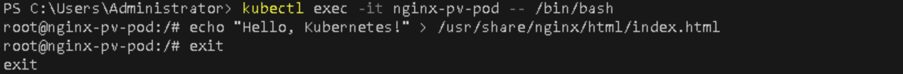

# **Create PersistentVolumes (PV) and PersistentVolumeClaims (PVC) for Data Storage**

## Table of Contents

1. [**Introduction**](#introduction)  
2. [**Problem Statement**](#problem-statement)  
3. [**Prerequisites**](#prerequisites)  
4. [**Setup Instructions**](#setup-instructions)  
   - [**Step 1: Create a PersistentVolume (PV)**](#step-1-create-a-persistentvolume-pv)  
   - [**Step 2: Create a PersistentVolumeClaim (PVC)**](#step-2-create-a-persistentvolumeclaim-pvc)  
   - [**Step 3: Use the PVC in a Pod**](#step-3-use-the-pvc-in-a-pod)  
5. [**References**](#references)  

---

## Introduction

In Kubernetes, **PersistentVolumes (PV)** and **PersistentVolumeClaims (PVC)** provide a way to manage storage resources for your applications. Persistent storage allows data to be retained even if the pod is terminated or restarted. This is critical for stateful applications like databases or any app that requires data persistence across pod restarts.

- **PersistentVolume (PV)**: A storage resource in the cluster that can be provisioned dynamically or manually by an administrator. It abstracts the underlying storage from the application.
- **PersistentVolumeClaim (PVC)**: A request by a user for storage. PVCs are used by pods to request specific storage resources from available PVs.

In this lab, we will create a PersistentVolume and a PersistentVolumeClaim, and then use the PVC in a Kubernetes pod.

---

## Problem Statement

Many applications require persistent data storage that survives pod restarts and scaling events. To solve this, Kubernetes provides PersistentVolumes (PVs) and PersistentVolumeClaims (PVCs) as a means to allocate and consume storage resources within the cluster. This lab will guide you through the steps required to configure persistent storage for an NGINX application.

---

## Prerequisites
Completion of all previous lab guides (up to Lab Guide-04) is required before proceeding with Lab Guide-05.

- A running Kubernetes cluster on Minikube.
- `kubectl` installed and configured to interact with your Minikube cluster.

---

## Setup Instructions

### Step 1: Create a PersistentVolume (PV)

A **PersistentVolume** represents a piece of storage in the cluster. This storage can be provided by cloud services, local disk, NFS, or other means.

1. **Create a PV YAML File**  

   Create a file named `pv.yaml` with the following content:
   
   ```yaml
   apiVersion: v1
   kind: PersistentVolume
   metadata:
     name: nginx-pv
   spec:
     capacity:
       storage: 1Gi
     accessModes:
       - ReadWriteOnce
     hostPath:
       path: "/mnt/data"
   ```

   Key points:
   - **capacity**: The size of the persistent storage (1Gi).
   - **accessModes**: Specifies how the storage can be accessed. `ReadWriteOnce` means it can be mounted as read-write by a single node.
   - **hostPath**: The path to the storage location on the host machine. For this lab, we use a directory on the Minikube node.

2. **Apply the PV**  

   Run the following command to create the PersistentVolume:
   ```bash
   kubectl apply -f pv.yaml
   ```

3. **Verify the PersistentVolume**  

   Check the status of the PV to ensure it's available:
   ```bash
   kubectl get pv
   ```

   


### Step 2: Create a PersistentVolumeClaim (PVC)

A **PersistentVolumeClaim** is a request for storage by a user. The PVC must match the properties of the PV, such as storage size and access modes.

1. **Create a PVC YAML File**

   Create a file named `pvc.yaml` with the following content:
   
   ```yaml
   apiVersion: v1
   kind: PersistentVolumeClaim
   metadata:
     name: nginx-pvc
   spec:
     accessModes:
       - ReadWriteOnce
     resources:
       requests:
         storage: 1Gi
   ```

   Key points:

   - **accessModes**: Matches the access mode of the PV (`ReadWriteOnce`).
   - **resources.requests.storage**: Requests 1Gi of storage.

2. **Apply the PVC** 

   Run the following command to create the PersistentVolumeClaim:

   ```bash
   kubectl apply -f pvc.yaml
   ```

3. **Verify the PVC** 

   Check that the PVC is successfully bound to the PV:

   ```bash
   kubectl get pvc
   ```

   

   The status should show `Bound`, meaning the PVC has successfully claimed the PV.

### Step 3: Use the PVC in a Pod

Now that the PVC is created and bound to the PV, we can use it in a pod to provide persistent storage for the application.

1. **Create the Pod YAML File**  

   Create a file named `nginx-pv-pod.yaml` with the following content:
   
   ```yaml
   apiVersion: v1
   kind: Pod
   metadata:
     name: nginx-pv-pod
   spec:
     containers:
     - name: nginx
       image: nginx:latest
       ports:
       - containerPort: 80
       volumeMounts:
       - mountPath: "/usr/share/nginx/html"
         name: nginx-storage
     volumes:
     - name: nginx-storage
       persistentVolumeClaim:
         claimName: nginx-pvc
   ```

   Key points:

   - **volumeMounts**: The PVC is mounted to `/usr/share/nginx/html` in the container, which is the default directory for serving content in NGINX.
   - **volumes**: The volume is backed by the PersistentVolumeClaim (`nginx-pvc`).

2. **Apply the Pod Configuration**  

   Run the following command to create the pod:

   ```bash
   kubectl apply -f nginx-pv-pod.yaml
   ```

3. **Verify the Pod**  

   Check the status of the pod to ensure it's running:

   ```bash
   kubectl get pods
   ```

   

4. **Test the Persistent Storage**

   You can now write files to the `/mnt/data` directory on the Minikube node, and they will persist even if the pod is deleted or restarted. 

   To test, exec into the pod and create a file:

   ```bash
   kubectl exec -it nginx-pv-pod -- /bin/bash
   echo "Hello, Kubernetes!" > /usr/share/nginx/html/index.html
   ```
   

   Now, access the NGINX pod using port-forwarding to see the content you just created:

   ```bash
   kubectl port-forward nginx-pv-pod 8085:80
   ```

   

   Open your browser and navigate to `http://localhost:8085`. You should see "Hello, Kubernetes!" displayed.

   

---

## References

- [Kubernetes Persistent Volumes Documentation](https://kubernetes.io/docs/concepts/storage/persistent-volumes/)
- [Kubernetes Persistent Volume Claims Documentation](https://kubernetes.io/docs/concepts/storage/persistent-volumes/#persistentvolumeclaims)

---