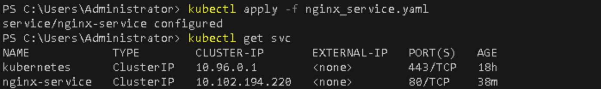
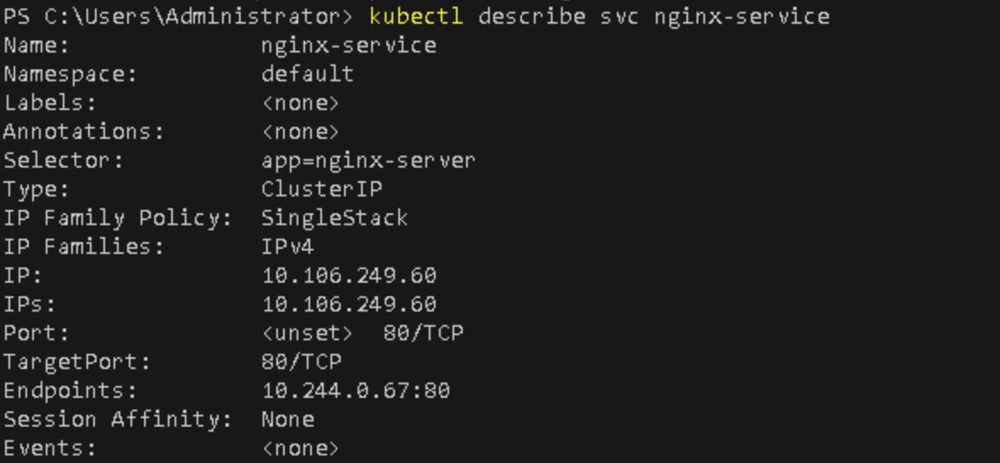

# **Set up NetworkPolicies to Control Traffic Between Pods**

## **Table of Contents**

1. [**Introduction**](#introduction)  
2. [**Problem Statement**](#problem-statement)  
3. [**Prerequisites**](#prerequisites)   
4. [**Setup Instructions**](#setup-instructions)  
   - [**Step 1: Deploy the Application Pods**](#step-1-deploy-the-application-pods)  
   - [**Step 2: Create a Service for the NGINX Server**](#step-2-create-a-service-for-the-nginx-server)  
   - [**Step 3: Create a NetworkPolicy to Restrict Traffic**](#step-3-create-a-networkpolicy-to-restrict-traffic)  
   - [**Step 4: Test the NetworkPolicy**](#step-4-test-the-networkpolicy)  
5. [**References**](#references)  

---

## **Introduction**

In Kubernetes, **NetworkPolicies** allow you to control how pods communicate with each other and with other network endpoints. By default, pods are non-isolated and can communicate freely within a cluster. NetworkPolicies help secure your applications by limiting the traffic flow between pods based on rules you define.

With NetworkPolicies, you can:
- Restrict inbound and outbound traffic to specific pods.
- Control traffic at both the application and network layer (TCP/IP).
- Improve the security posture of your Kubernetes clusters by implementing "least privilege" networking policies.

In this lab, you will learn how to create a **NetworkPolicy** to restrict pod-to-pod communication, allowing only specific traffic to flow between pods.

---

## **Problem Statement**

By default, Kubernetes allows unrestricted communication between all pods in a cluster. However, many applications require more restrictive network configurations. For example, you may want to prevent certain pods from receiving traffic from other pods or limit which services can communicate with a backend database. NetworkPolicies solve this by enabling fine-grained control over network traffic between pods.

In this lab, we will create an example where:
- Two pods are deployed in the same namespace.
- Network traffic between the pods is restricted using a NetworkPolicy, allowing only specific pods to communicate.

---

## **Prerequisites**
Completion of all previous lab guides (up to Lab Guide-05) is required before proceeding with Lab Guide-06.

- A running Kubernetes cluster on Minikube.
- `kubectl` installed and configured to interact with your Minikube cluster.
- Basic understanding of Kubernetes pods and networking concepts.

---

## **Setup Instructions**

### **Step 1: Deploy the Application Pods**

First, we will deploy two simple NGINX pods in the same namespace. One will act as a client, and the other will act as a web server.

1. **Create a Deployment YAML File for the NGINX Web Server**  
   Create a file named `nginx-server-deployment.yaml` with the following content:

   ```yaml
   apiVersion: apps/v1
   kind: Deployment
   metadata:
     name: nginx-server
   spec:
     replicas: 1
     selector:
       matchLabels:
         app: nginx-server
     template:
       metadata:
         labels:
           app: nginx-server
       spec:
         containers:
         - name: nginx
           image: nginx:latest
           ports:
           - containerPort: 80
   ```

2. **Create a Deployment YAML File for the NGINX Client**  
   Create a file named `nginx-client-deployment.yaml` with the following content:

   ```yaml
   apiVersion: apps/v1
   kind: Deployment
   metadata:
     name: nginx-client
   spec:
     replicas: 1
     selector:
       matchLabels:
         app: nginx-client
     template:
       metadata:
         labels:
           app: nginx-client
       spec:
         containers:
         - name: busybox
           image: busybox
           command: ["sleep", "3600"]
   ```

3. **Apply the Deployments**  
   Run the following commands to create both the NGINX server and client pods:

   ```bash
   kubectl apply -f nginx-server-deployment.yaml
   ```
   


   ```bash
   kubectl apply -f nginx-client-deployment.yaml
   ```
   

4. **Verify the Pods are Running**  
   Ensure both pods are running by listing all the pods in your namespace:

   ```bash
   kubectl get pods
   ```

   

### **Step 2: Create a Service for the NGINX Server**

In Kubernetes, pods are generally ephemeral, and DNS names for individual pods are not resolvable directly. To ensure that other pods can communicate with the `nginx-server` pod by name, we need to create a Service. The Service provides a stable DNS name and IP address for the NGINX server.

1. **Create the Service YAML**  
   Create a file named `nginx_service.yaml` with the following content:

   ```yaml
   apiVersion: v1
   kind: Service
   metadata:
     name: nginx-service
   spec:
     selector:
       app: nginx-server
     ports:
     - protocol: TCP
       port: 80
       targetPort: 80
   ```

   Key points:
   - **selector**: Matches the `nginx-server` pods using the label `app: nginx-server`.
   - **ports**: Exposes port 80 to other pods in the cluster.

2. **Apply the Service**  
   Run the following command to create the Service:

   ```bash
   kubectl apply -f nginx_service.yaml
   ```

3. **Verify the Service**  
   Check that the Service is created and available:

   ```bash
   kubectl get svc
   ```

   

   You should see the `nginx_service` listed, which will expose the NGINX server pod to other pods via the DNS name `nginx_service`.

---

### **Step 3: Create a NetworkPolicy to Restrict Traffic**

Now that the pods are running, we will create a NetworkPolicy that allows traffic only from the NGINX client to the NGINX server, and blocks all other inbound traffic to the server.

1. **Create a NetworkPolicy YAML File**  
   Create a file named `nginx-networkpolicy.yaml` with the following content:

   ```yaml
   apiVersion: networking.k8s.io/v1
   kind: NetworkPolicy
   metadata:
     name: allow-nginx-client
   spec:
     podSelector:
       matchLabels:
         app: nginx-server
     policyTypes:
     - Ingress
     ingress:
     - from:
       - podSelector:
           matchLabels:
             app: nginx-client
       ports:
       - protocol: TCP
         port: 80
   ```

   Key points:
   - **podSelector**: Specifies the pods to which this NetworkPolicy applies (in this case, the NGINX server).
   - **policyTypes**: Defines the type of policy (Ingress in this case, meaning traffic coming into the pod).
   - **ingress**: Defines which pods can send traffic to the NGINX server. Only traffic from pods with the label `app: nginx-client` is allowed.

2. **Apply the NetworkPolicy**  
   Run the following command to create the NetworkPolicy:

   ```bash
   kubectl apply -f nginx-networkpolicy.yaml
   ```

3. **Verify the NetworkPolicy**  
   Check that the NetworkPolicy was created successfully:

   ```bash
   kubectl get networkpolicies
   ```

   

### **Step 4: Test the NetworkPolicy**

With the NetworkPolicy in place, we can now test its effect on pod-to-pod communication.

1. **Test from the NGINX Client**  
   
   You can get the IP address of the nginx server from the output of the following command:

   ```bash
   kubectlget pod nginx-server-5df8f66fb7-24wzl -o wide
   ```

   

   
   Exec into the NGINX client pod and try to access the NGINX server using the IP address obtained earlier (10.244.0.67):

   ```
   kubectl exec -it <nginx-client-pod> -- wget --spider --timeout=1 <nginx-server-ip>
   ```
   

   This request should succeed because the NetworkPolicy allows traffic from the client to the server.


2. **Test from a Different Pod**  
   Deploy another pod that does not match the `nginx-client` label, such as a `busybox` pod:

   ```bash
   kubectl run busybox --image=busybox --command -- sleep 3600
   ```
   
   
   Now, try to access the NGINX server from this `busybox` pod:

   You can get the IP address of the nginx server from the output of the following command:
  
   ```bash 
   kubectl describe svc nginx-service
   ```
   This command provides detailed information about the nginx service, including its IP address.
  
   

   
   ```bash
   kubectl get pods --show-labels
   ```
   
  
   
   Use the command `kubectl exec -it busybox -- wget --spider --timeout=1 10.109.249.60`, where `10.109.249.60` is the IP address you get from the command `kubectl describe svc nginx-service`.

   ```bash
   kubectl exec -it busybox -- wget --spider --timeout=1 <nginx-server-ip>
   ```
   
  

   This request should fail because the NetworkPolicy only allows traffic from the `nginx-client` pod.

---

## **References**

- [Kubernetes NetworkPolicy Documentation](https://kubernetes.io/docs/concepts/services-networking/network-policies/)
- [Minikube Documentation](https://minikube.sigs.k8s.io/docs/start/)

---