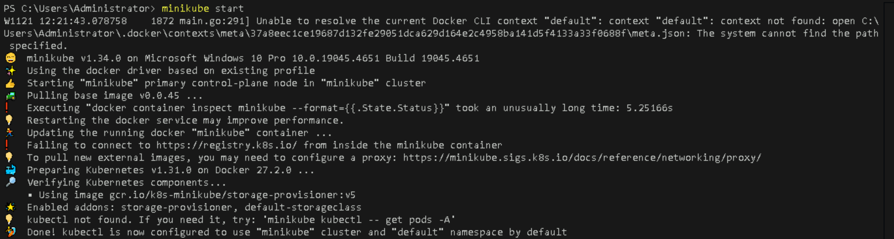
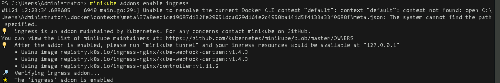
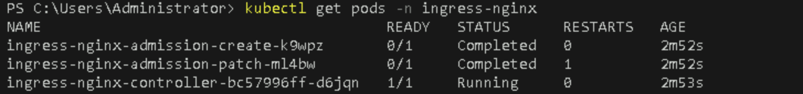
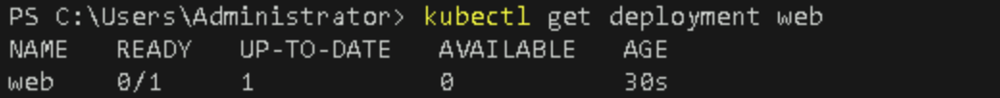
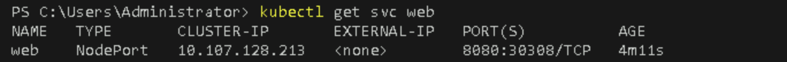
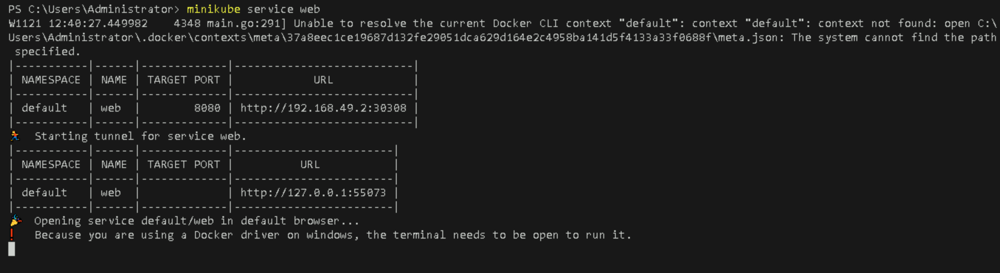

# **Create an Ingress Resource for External Access to Your Application**

## **Table of Contents**

1. [**Introduction**](#introduction)  
2. [**Problem Statement**](#problem-statement)  
3. [**Prerequisites**](#prerequisites)   
4. [**Setup Instructions**](#setup-instructions)  
   - [**Step 1: Create a Minikube Cluster**](#step-1-create-a-minikube-cluster)  
   - [**Step 2: Enable the Ingress Controller**](#step-2-enable-the-ingress-controller)  
   - [**Step 3: Deploy a Hello World Application**](#step-3-deploy-a-hello-world-application)  
   - [**Step 4: Create the Ingress Resource**](#step-4-create-the-ingress-resource)  
   - [**Step 5: Test the Ingress**](#step-5-test-the-ingress)  
5. [**References**](#references)  

---

## **Introduction**

In Kubernetes, an **Ingress** resource defines rules that allow external access to services within a cluster. It acts as a gateway, managing traffic and routing requests based on defined rules. In this lab, you will set up an Ingress resource in a Minikube environment to provide external access to a sample web application.

---

## **Problem Statement**

As applications within a Kubernetes cluster grow, the need for external access becomes paramount. Traditional methods, such as NodePort Services, can expose services, but they lack advanced routing capabilities. Ingress solves this problem by providing a single entry point to your applications, allowing for better management and easier access.

---

## **Prerequisites**
Completion of all previous lab guides (up to Lab Guide-06) is required before proceeding with Lab Guide-07.

- **Minikube** installed on your Windows machine.
- **kubectl** command-line tool installed and configured to communicate with your Minikube cluster.
- Ensure your Minikube version is compatible (at least Kubernetes v1.19).
  
---

## **Setup Instructions**

### **Step 1: Create a Minikube Cluster**

1. **Start Minikube**  
   Open PowerShell or Command Prompt as Administrator and run:

   ```bash
   minikube start
   ```

   

   This command will create a local Kubernetes cluster.

### **Step 2: Enable the Ingress Controller**

1. **Enable NGINX Ingress Controller**  
   Run the following command in your terminal:

   ```bash
   minikube addons enable ingress
   ```

   

2. **Verify the Ingress Controller is Running**  
   After a few moments, verify that the Ingress controller is running with:

   ```bash
   kubectl get pods -n ingress-nginx
   ```

   

   You should see the NGINX Ingress controller listed and running.

### **Step 3: Deploy a Hello World Application**

1. **Create a Deployment**  
   Deploy a sample Hello World application:

   ```bash
   kubectl create deployment web --image=gcr.io/google-samples/hello-app:1.0
   ```

   

   Confirm the deployment is successful by running:

   ```bash
   kubectl get deployment web
   ```

   

2. **Expose the Deployment**  
   Expose the deployment with NodePort:

   ```bash
   kubectl expose deployment web --type=NodePort --port=8080
   ```

   

3. **Verify the Service**  
   Check the service to ensure it's available:

   ```bash
   kubectl get svc web
   ```

   

   Note the `NodePort` assigned to the service.

### **Step 4: Create the Ingress Resource**

1. **Create an Ingress YAML File**  
   Create a file named `example-ingress.yaml` with the following content:

   ```yaml
   apiVersion: networking.k8s.io/v1
   kind: Ingress
   metadata:
     name: example-ingress
     annotations:
       nginx.ingress.kubernetes.io/rewrite-target: /
   spec:
     ingressClassName: nginx
     rules:
       - host: hello-world.example
         http:
           paths:
             - path: /
               pathType: Prefix
               backend:
                 service:
                   name: web
                   port:
                     number: 8080
   ```

2. **Apply the Ingress Resource**  
   Use the following command to create the Ingress:

   ```bash
   kubectl apply -f example-ingress.yaml
   ```

   

3. **Verify the Ingress**  
   Check the status of the Ingress:

   ```bash
   kubectl get ingress
   ```

   

   Note: It may take a minute to assign an address.

### **Step 5: Test the Ingress**

1. **Update the Hosts File** 

   Open the `hosts` file with administrative rights (located at `C:\Windows\System32\drivers\etc\hosts`) and add the following line using the IP address returned by `minikube ip`:

   
    
   
   ```
   <minikube-ip> hello-world.example
   ``` 

   Replace `<minikube-ip>` with the actual IP address from the previous command.

2. **Test the Ingress**  

   Visit the Service via NodePort, using the `minikube service` command:

   ```bash
   minikube service web
   ```

   
   
   The above command will open the `sample application` .

   **The output is similar to:**

   ```output
   Hello, world!
   Version: 1.0.0
   Hostname: web-56b9569dcc-48zbn
   ```

   
   
   > **Note:** On Linux System we can test ingress using `Minikube IP` address instead of Localhost i.e., `127.0.0.1`

---

## **References**

- [Kubernetes Ingress Documentation](https://kubernetes.io/docs/concepts/services-networking/ingress/)
- [Minikube Ingress Documentation](https://minikube.sigs.k8s.io/docs/handbook/addons/)

---