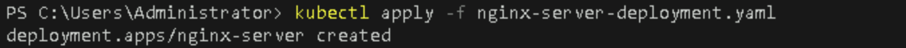
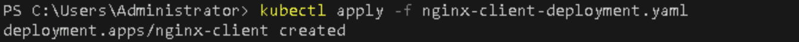
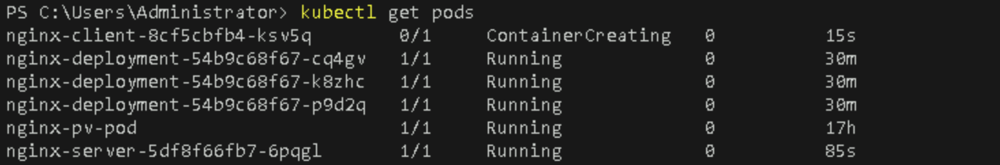
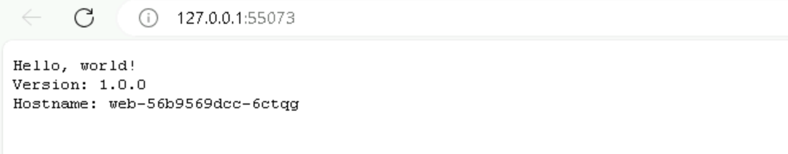

# **Deploy Prometheus and Grafana for Monitoring Your Kubernetes Cluster**

## Table of Contents

1. [**Introduction**](#introduction)
2. [**Problem Statement**](#problem-statement)
3. [**Prerequisites**](#prerequisites)
   - [**Software Requirements**](#software-requirements)
   - [**Hardware Requirements**](#hardware-requirements)
4. [**Lab Guide: Deploying Prometheus and Grafana for Monitoring a Kubernetes Cluster**](#lab-guide-deploying-prometheus-and-grafana)
   - [**Step 1: Set Up Prometheus**](#step-1-set-up-prometheus)
   - [**Step 2: Set Up Grafana**](#step-2-set-up-grafana)
   - [**Step 3: Access Prometheus and Grafana Dashboards**](#step-3-access-prometheus-and-grafana-dashboards)
   - [**Step 4: Configure Grafana Dashboards for Kubernetes Metrics**](#step-4-configure-grafana-dashboards-for-kubernetes-metrics)
5. [**References**](#references)

---

## Introduction

Prometheus and Grafana are essential tools for monitoring the health and performance of Kubernetes clusters. **Prometheus** is an open-source monitoring system that collects metrics from different sources and stores them in a time-series database. **Grafana**, on the other hand, is a powerful tool for creating dynamic dashboards based on data collected by Prometheus.

In this guide, you will deploy Prometheus and Grafana on a Kubernetes cluster using Minikube, enabling real-time monitoring of cluster metrics.

## Problem Statement

As Kubernetes clusters grow in complexity, it becomes increasingly important to monitor the state of your nodes, workloads, and resources. Prometheus can scrape metrics from your Kubernetes components, and Grafana allows you to visualize those metrics through customizable dashboards. This lab will walk you through deploying these tools in your Minikube cluster.

## Prerequisites
Completion of all previous lab guides (up to Lab Guide-07) is required before proceeding with Lab Guide-08.

- A working **Minikube** cluster on Windows.
- **kubectl** installed and configured to interact with your cluster.
- Basic understanding of Kubernetes objects (Deployments, Services, etc.).
  
### Software Requirements

- **Minikube**: v1.19 or later
- **kubectl**: Latest version compatible with your Kubernetes setup
- **Helm**: Latest version (for easy Prometheus and Grafana installation)

### Hardware Requirements

- Minimum 2 CPU cores
- 4GB RAM for Minikube cluster

## Lab Guide: Deploying Prometheus and Grafana

### Step 1: Set Up Prometheus

1. **Install Helm (if not installed)**  
   Helm simplifies the installation of Kubernetes applications. Download and install Helm from the official website [here](https://helm.sh/docs/intro/install/).

2. **Add Prometheus Helm Repository**  
   Run the following command to add the Prometheus Helm charts repository:

   ```bash
   helm repo add prometheus-community https://prometheus-community.github.io/helm-charts
   helm repo update
   ```

   

3. **Install Prometheus**  
   Now, install Prometheus using the Helm chart:

   ```bash
   helm install prometheus prometheus-community/prometheus --namespace monitoring --create-namespace
   ```

   

   This will create a `monitoring` namespace and install Prometheus in your cluster.

4. **Verify Prometheus Deployment**  
   Check if the Prometheus pods are running:

   ```bash
   kubectl get pods -n monitoring
   ```

   

   You should see several pods, including `prometheus-server`, `alertmanager`, and `node-exporter`.

### Step 2: Set Up Grafana

1. **Add Grafana Helm Repository**  
   Run the following command to add the Grafana Helm charts repository:

   ```bash
   helm repo add grafana https://grafana.github.io/helm-charts
   helm repo update
   ```

   

2. **Install Grafana**  
   Use the Helm chart to install Grafana:

   ```bash
   helm install grafana grafana/grafana --namespace monitoring
   ```

   

   This will deploy Grafana in the same `monitoring` namespace.

3. **Verify Grafana Deployment**  
   Check the status of the Grafana pod:

   ```bash
   kubectl get pods -n monitoring
   ```

   

   You should see a `grafana` pod running.

4. **Get Grafana Admin Password**  

   The default Grafana admin password is stored in a Kubernetes secret. Retrieve it with:

   ```bash
   kubectl get secret --namespace monitoring grafana -o jsonpath="{.data.admin-password}" | ForEach-Object { [System.Text.Encoding]::UTF8.GetString([System.Convert]::FromBase64String($_)) }
   ```

   

5. **Expose Grafana for External Access**  

   To access Grafana from your local machine, run:

   ```bash
   kubectl port-forward --namespace monitoring svc/grafana 3000:80
   ```

   

   Now, open your browser and navigate to `http://localhost:3000`. The default username is `admin`, and the password is the one you retrieved in the previous step.

### Step 3: Access Prometheus and Grafana Dashboards

1. **Access Prometheus UI**  

   Forward the Prometheus service to access it locally:

   ```bash
   kubectl port-forward --namespace monitoring svc/prometheus-server 9090:80
   ```

   

   Visit `http://localhost:9090` to access the Prometheus dashboard. You can explore the metrics that are being scraped from your cluster.

2. **Access Grafana UI**  

   Open your browser and navigate to `http://localhost:3000`. Log in using your admin credentials (username: `admin`, password: the one you retrieved earlier).

   

### Step 4: Configure Grafana Dashboards for Kubernetes Metrics

1. **Log in to Grafana**  

   Open your browser and navigate to `http://localhost:3000`. Log in using your admin credentials (username: `admin`, password: the one you retrieved earlier).

   

2. **Navigate to "Connections" Section** 

   - From the left-hand menu, click on **Connections** (this might be called "Connections" or "Data Sources" depending on your version).
   - In the **Connections** tab, click on **Add new connection**.

   

3. **Search for Prometheus**  

   - In the search bar that appears, type **Prometheus**.
   - Select **Prometheus** from the list of available data sources.

   

4. **Configure the Prometheus Data Source**  

   - On the right corner of the screen, click **Add new data source**.

   

   - In the **HTTP URL** field (under **Connection details**), 
     
     If you are accessing Prometheus via its service within the cluster, you should use the service URL instead: `http://prometheus-server.monitoring.svc.cluster.local:80`.

     

5. **Save & Test**  

   - Scroll to the bottom of the page and click **Save & Test** to verify the connection to Prometheus.

     

   - You should see a success message indicating that Grafana successfully connected to Prometheus.

    

6. **Import Pre-built Kubernetes Dashboards**  

   Grafana has many pre-built Kubernetes monitoring dashboards. To import one:

   - In the Grafana UI, click **+ > Import Dashboard**.

     

   - Use the following dashboard ID: `315` and click `load`. This is a popular Kubernetes cluster monitoring dashboard.

    

   - select the Prometheus data source, and click **Import**.

   

7. **View Your Kubernetes Metrics**  

   After importing the dashboard, you'll be able to see metrics like CPU usage, memory utilization, pod status, and more for your Kubernetes cluster.

   

---

## References

- [Prometheus Documentation](https://prometheus.io/docs/introduction/overview/)
- [Grafana Documentation](https://grafana.com/docs/)
- [Helm Documentation](https://helm.sh/docs/intro/)

---