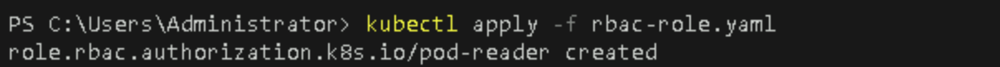
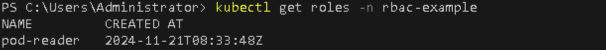
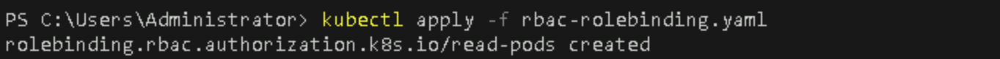
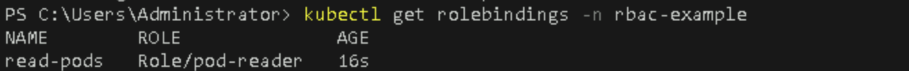
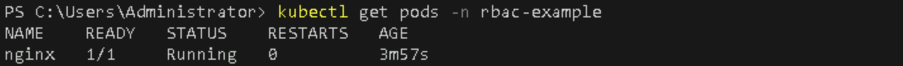
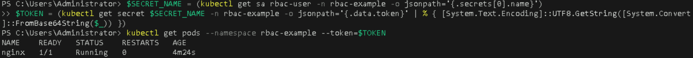

# **Create Roles, Role Bindings, and Service Accounts for RBAC in Kubernetes**

## Table of Contents

1. [**Introduction**](#introduction)
2. [**Problem Statement**](#problem-statement)
3. [**Prerequisites**](#prerequisites)
   - [**Software Requirements**](#software-requirements)
   - [**Hardware Requirements**](#hardware-requirements)
4. [**Lab Guide: Create Roles, Role Bindings, and Service Accounts for RBAC in Kubernetes**](#lab-guide-create-roles-role-bindings-and-service-accounts-for-rbac)
   - [**Step 1: Create a Namespace**](#step-1-create-a-namespace)
   - [**Step 2: Create a Service Account**](#step-2-create-a-service-account)
   - [**Step 3: Create a Role**](#step-3-create-a-role)
   - [**Step 4: Create a RoleBinding**](#step-4-create-a-rolebinding)
   - [**Step 5: Deploy a Simple Application**](#step-5-deploy-a-simple-application)
   - [**Step 6: Verify RBAC Configuration**](#step-6-verify-rbac-configuration)
5. [**References**](#references)

---

## Introduction

Kubernetes provides a powerful Role-Based Access Control (RBAC) mechanism to manage permissions and access to resources within your cluster. By defining roles and bindings, you can enforce fine-grained control over who can do what in your cluster. This guide will walk you through the process of creating roles, role bindings, and service accounts in a Kubernetes environment using Minikube.

## Problem Statement

Managing access permissions is critical for maintaining security in a Kubernetes cluster. Without proper RBAC configuration, unauthorized users may gain access to sensitive resources or perform actions that could compromise the stability and security of the cluster. This lab will demonstrate how to implement RBAC by creating roles, role bindings, and service accounts in your Minikube environment.

## Prerequisites
Completion of all previous lab guides (up to Lab Guide-08) is required before proceeding with Lab Guide-09.

- A running **Minikube** cluster on Windows.
- **kubectl** installed and configured to interact with your cluster.
- Basic understanding of Kubernetes objects (Namespaces, Roles, RoleBindings, ServiceAccounts, etc.).

### Software Requirements

- **Minikube**: v1.19 or later
- **kubectl**: Latest version compatible with your Kubernetes setup

### Hardware Requirements

- Minimum 2 CPU cores
- 2GB RAM for Minikube cluster

## Lab Guide: Create Roles, Role Bindings, and Service Accounts for RBAC

### Step 1: Create a Namespace

1. **Create a New Namespace**  
   First, we will create a separate namespace for our RBAC tests:

   ```bash
   kubectl create namespace rbac-example
   ```

  > **Note:**  
  >
  > A **namespace** is a way to divide cluster resources between multiple users or teams. It helps to organize resources and manage them more effectively.

  

2. **Verify the Namespace**  
   Check if the namespace has been created successfully:

   ```bash
   kubectl get namespaces
   ```

   

### Step 2: Create a Service Account

1. **Create a Service Account**  
   Run the following command to create a service account named `rbac-user` in the `rbac-example` namespace:

   ```bash
   kubectl create serviceaccount rbac-user --namespace rbac-example
   ```

   > **Note:**  
   >
   > A **Service Account** is an account for processes in a Pod. When a Pod runs, it can access the Kubernetes API using the Service Account credentials.

   

2. **Verify the Service Account**  

   Check if the service account has been created:

   ```bash
   kubectl get serviceaccounts -n rbac-example
   ```

   

### Step 3: Create a Role

1. **Define a Role**  

   Create a YAML file named `rbac-role.yaml` with the following content:

   ```yaml
   apiVersion: rbac.authorization.k8s.io/v1
   kind: Role
   metadata:
     namespace: rbac-example
     name: pod-reader
   rules:
     - apiGroups: [""]
       resources: ["pods"]
       verbs: ["get", "list", "watch"]
   ```

   > **Note:** 
   >  
   > A **Role** defines permissions for resources within a specific namespace. In this example, the `pod-reader` role allows reading Pods in the `rbac-example` namespace.

2. **Apply the Role**  
   Run the following command to create the role:

   ```bash
   kubectl apply -f rbac-role.yaml
   ```

   

3. **Verify the Role**  
   Check if the role has been created:

   ```bash
   kubectl get roles -n rbac-example
   ```

   

### Step 4: Create a RoleBinding

1. **Define a RoleBinding**  
   Create a YAML file named `rbac-rolebinding.yaml` with the following content:

   ```yaml
   apiVersion: rbac.authorization.k8s.io/v1
   kind: RoleBinding
   metadata:
     name: read-pods
     namespace: rbac-example
   subjects:
     - kind: ServiceAccount
       name: rbac-user
       namespace: rbac-example
   roleRef:
     kind: Role
     name: pod-reader
     apiGroup: rbac.authorization.k8s.io
   ```

   > **Note:** 
   >  
   > A **RoleBinding** grants the permissions defined in a Role to a specific subject (like a Service Account) within a namespace.

2. **Apply the RoleBinding**  
   Run the following command to create the role binding:

   ```bash
   kubectl apply -f rbac-rolebinding.yaml
   ```

   

3. **Verify the RoleBinding**  
   Check if the role binding has been created:

   ```bash
   kubectl get rolebindings -n rbac-example
   ```

   

### Step 5: Deploy a Simple Application

1. **Deploy an Nginx Pod**  
   To test the RBAC configuration, we will deploy a simple Nginx application in the `rbac-example` namespace:

   ```bash
   kubectl run nginx --image=nginx --restart=Never --namespace=rbac-example
   ```

   > **Note:**  
   >
   > This command creates a Pod named `nginx` using the Nginx image, which will be used to verify that the `rbac-user` service account can access the resources.

   

2. **Verify the Nginx Pod**  

   Check if the Nginx Pod is running:

   ```bash
   kubectl get pods -n rbac-example
   ```

   

### Step 6: Verify RBAC Configuration

1. **Test the Permissions of the Service Account**  

   First, you need to get the token for the service account using PowerShell:

   ```powershell
   $SECRET_NAME = (kubectl get sa rbac-user -n rbac-example -o jsonpath='{.secrets[0].name}')
   $TOKEN = (kubectl get secret $SECRET_NAME -n rbac-example -o jsonpath='{.data.token}' | % { [System.Text.Encoding]::UTF8.GetString([System.Convert]::FromBase64String($_)) })
   ```

2. **Use the Service Account Token**  

   Now, you can test the permissions using `kubectl` with the service account token:

   ```bash
   kubectl get pods --namespace rbac-example --token=$TOKEN
   ```

   

   If the RBAC configuration is correct, you should see the Nginx pod listed. If no pods are present in the `rbac-example` namespace, you will receive a message saying "No resources found in rbac-example namespace." This is expected if you have not deployed any resources yet.

---

## References

- [Kubernetes RBAC Documentation](https://kubernetes.io/docs/reference/access-authn-authz/rbac/)
- [Kubernetes Service Accounts Documentation](https://kubernetes.io/docs/tasks/configure-pod-container/configure-service-account/)

---