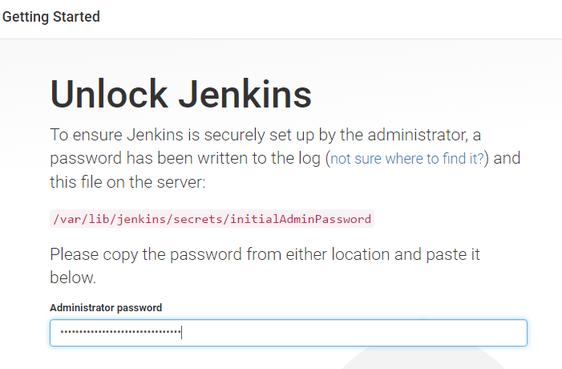
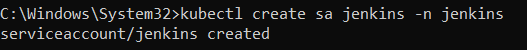

# **Set up a CI/CD Pipeline to Automate Application Deployment to Kubernetes Using Jenkins**

## **Table of Contents**

1. [**Introduction**](#introduction)
2. [**Problem Statement**](#problem-statement)
3. [**Prerequisites**](#prerequisites)
   - [**Software Requirements**](#software-requirements)
   - [**Hardware Requirements**](#hardware-requirements)
4. [**Lab Guide: Setting Up CI/CD Pipeline with Jenkins and Kubernetes**](#lab-guide)
   - [**Step 1: Download and Install Jenkins**](#step-1-download-and-install-jenkins)
   - [**Step 2: Create a Kubernetes Service Account for Jenkins**](#step-2-create-a-kubernetes-service-account-for-jenkins)
   - [**Step 3: Set Up Jenkins Kubernetes Plugin**](#step-3-set-up-jenkins-kubernetes-plugin)
   - [**Step 4: Create and Run a Jenkins Pipeline**](#step-4-create-and-run-a-jenkins-pipeline)
5. [**References**](#references)

---

## **Introduction**

CI/CD pipelines automate the process of integrating code changes, testing, and deploying applications. In this guide, we'll set up **Jenkins** on a Windows machine and configure it to deploy applications to a **Kubernetes** cluster using the **Kubernetes Plugin**. Jenkins will run the deployments in Kubernetes pods, which will allow seamless integration and testing directly within the cluster environment.

---

## **Problem Statement**

Manually deploying applications to Kubernetes can be time-consuming and error-prone. By setting up a CI/CD pipeline using Jenkins and Kubernetes, we can automate the deployment process, ensuring quick, reliable, and continuous integration of code changes to our Kubernetes environment.

---

## **Prerequisites**
Completion of all previous lab guides (up to Lab Guide-09) is required before proceeding with Lab Guide-10.

- A **Kubernetes** cluster running on **Minikube** or another environment.
- **kubectl** configured to interact with the Kubernetes cluster.
- A Windows machine to install Jenkins.

### **Software Requirements**

- **Jenkins** (download as MSI)
- **Java Development Kit (JDK)** 8 or later (required for Jenkins)
- **Minikube** (if using a local Kubernetes cluster)
- **kubectl** CLI tool for managing Kubernetes

### **Hardware Requirements**

- Minimum 2 CPU cores
- 4GB RAM for Minikube and Jenkins

---

## **Lab Guide: Setting Up CI/CD Pipeline with Jenkins and Kubernetes**

### **Step 1: Download and Install Jenkins**

1. **Download Jenkins MSI**  
   Go to the Jenkins website and download the Windows installer [here](https://www.jenkins.io/download/).

   

2. **Install Jenkins**  
   - Double-click the MSI file and follow the instructions to install Jenkins.

   

   - Add Destination folder

   

   - Run Service on Local System

   

   - Add port number `8080` and `Test Port`

   

   - Select java home directory

   

   

   - Click on Install

   

   - During the installation, Jenkins will ask for the installation path, Java path, and a port number (default is 8080).

3. **Start Jenkins**  
   Once the installation is complete, start Jenkins by visiting `http://localhost:8080` in your browser.

   

4. **Unlock Jenkins**  
   During the initial setup, Jenkins will ask for an admin password. Find the password in the following file:

   ```
   C:\Program Files (x86)\Jenkins\secrets\initialAdminPassword
   ```

5. **Install Suggested Plugins**  
   Jenkins will prompt you to install the suggested plugins. Complete this step and create an admin user when prompted.

   

   

---

### **Step 2: Create a Kubernetes Service Account for Jenkins**

1. **Create the Jenkins Namespace**  
   Run the following command to create a namespace for Jenkins:

   ```bash
   kubectl create namespace jenkins
   ```

   

2. **Create a Service Account for Jenkins**  
   In the Jenkins namespace, create a service account for Jenkins to access the Kubernetes cluster:

   ```bash
   kubectl create sa jenkins -n jenkins
   ```

   

3. **Generate a Token for Jenkins**  
   Generate a token for the Jenkins service account with a duration of one year:

   ```bash
   kubectl create token jenkins -n jenkins --duration=8760h
   ```

   

   **Save the token** as it will be needed when configuring Jenkins.

4. **Create a RoleBinding for Jenkins**  
   Assign admin-level access to Jenkins using the following RoleBinding command:

   ```bash
   kubectl create rolebinding jenkins-admin-binding --clusterrole=admin --serviceaccount=jenkins:jenkins --namespace=jenkins
   ```

   

---

### **Step 3: Set Up Jenkins Kubernetes Plugin**

1. **Access Jenkins**  
   Open your browser and go to `http://localhost:8080`.

2. **Install Kubernetes Plugin**  
   - Go to **Manage Jenkins > Manage Plugins**.

   

   - In the **Available** tab, search for "Kubernetes" and install the **Kubernetes Plugin**.

   

3. **Configure Jenkins to Connect to Kubernetes**

   - Go to **Manage Jenkins > Cloud**.

   

   - click **Add a new cloud**. Select **Kubernetes**.

   

   

   - Configure the following settings:
     - **Kubernetes URL**: Obtain the URL by running `kubectl config view` and look for the `cluster.server` field.

     

     - **Kubernetes Namespace**: Enter `jenkins`.

     

     - **Jenkins URL**: Add your Jenkins URL (`http://localhost:8080`) and ensure **WebSocket** is enabled.

     

     - **Disable HTTPS Certificate Check**: Ensure this is checked for local environments.
   
   - In the **Credentials** section, use the token created earlier by selecting **Add > Jenkins** and selecting **Secret Text**. Paste the Kubernetes token from the earlier step.

   

4. **Test the Connection**  
   - Click **Test Connection** to verify Jenkins can connect to Kubernetes. If the connection is successful, click **Save**.

   

---

### **Step 4: Create and Run a Jenkins Pipeline**

1. **Create a New Pipeline Job**  
   - In Jenkins, click **New Item**, select **Pipeline**, and give it a name.

   

2. **Define the Pipeline Script**  
   In the pipeline script section, use the following code to create a pipeline that deploys and runs an Nginx container in a Kubernetes pod:

   ```groovy
   pipeline {
     agent {
       kubernetes {
         yaml '''
           apiVersion: v1
           kind: Pod
           spec:
             containers:
             - name: nginx
               image: nginx:alpine
               command:
               - cat
               tty: true
         '''
       }
     }
     stages {
       stage('Run Nginx') {
         steps {
           container('nginx') {
             // Check the Nginx version
             sh 'nginx -v'
           }
         }
       }
     }
   }
   ```

   

3. **Run the Pipeline**  
   - Click **Build Now** to run the pipeline.
   - Jenkins will create a pod in your Kubernetes cluster and run the Nginx container inside it.

4. **Verify Deployment**  
   To check if the pod was created successfully, run the following command in your terminal:

   ```bash
   kubectl get pods -n jenkins
   ```

   

   You should see a pod with the Nginx container running.

---

## **References**

- [Jenkins Official Website](https://www.jenkins.io/)
- [Kubernetes Official Documentation](https://kubernetes.io/docs/)
- [Minikube Documentation](https://minikube.sigs.k8s.io/docs/start/)

---
